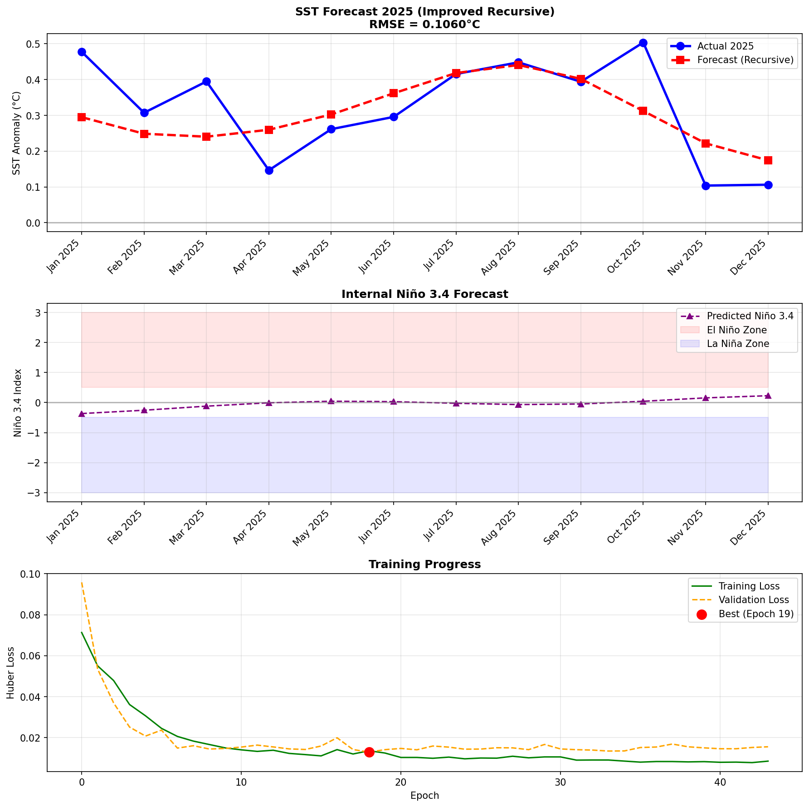

# Indonesian SST Anomaly Prediction with LSTM


## Project Overview
Proyek ini memprediksi **Anomali Suhu Permukaan Laut (SST)** di perairan Indonesia menggunakan **Multivariate LSTM dengan Recursive Forecasting**. Model memanfaatkan **Niño 3.4 Index** sebagai prediktor dinamis untuk menangkap fenomena **El Niño-Southern Oscillation (ENSO)**.

---

## Project Structure

```
enso-forecasting/
├── data/
│   ├── raw/                    # Raw external data
│   │   └── nina34.anom.data.txt
│   └── processed/              # Processed data ready for modeling
│       └── sst_indo_clean.csv
├── data_sst/                   # Raw NetCDF files (gitignored)
├── output/
│   ├── figures/                # Generated plots and visualizations
│   │   ├── validation_2025_improved.png
│   │   └── sst_anomaly_trend.png
│   └── models/                 # Saved model checkpoints
│       └── best_model_2025_recursive_v2.pt
├── docs/                       # Documentation
│   └── TECHNICAL_DOCUMENTATION.md
├── download_data.py            # Download NetCDF from NOAA
├── preprocessing.py            # ETL: NetCDF → CSV
└── validation_2025.py          # Main Script: Recursive Forecasting (Train: 2000-2024, Test: 2025)
```

---

## Data Sources
| Data | Source | Location |
|------|--------|----------|
| Indonesian SST | NOAA OISST V2 | `data/processed/sst_indo_clean.csv` |
| Niño 3.4 Index | NOAA ERSSTv5 | `data/raw/nina34.anom.data.txt` |

### Raw NetCDF Data (Not Included)
Folder `data_sst/` berisi file NetCDF mentah dari NOAA (~500MB per file) yang **tidak di-upload ke GitHub** karena ukurannya terlalu besar.

**Workflow:**
1. `download_data.py` → Download data NetCDF dari NOAA ke folder `data_sst/`
2. `preprocessing.py` → Olah data NetCDF menjadi `data/processed/sst_indo_clean.csv`

---

## Training Approach

Script `validation_2025.py` menggunakan **Recursive Autoregressive Forecasting**:
- **Training Data**: 2000-2024 (split 90% train / 10% validation)
- **Test Data**: 2025 (diambil langsung dari raw NetCDF, tidak pernah dilihat saat training)
- **Metode**: Model memprediksi 1 bulan, lalu menggunakan prediksinya sendiri sebagai input bulan berikutnya
- **Niño 3.4**: Diprediksi secara internal (bukan dari data aktual masa depan)

> **Pure Forecasting**: Tidak ada data 2025 yang dipakai saat inference - mensimulasikan skenario nyata memprediksi masa depan.

---

## Model Architecture (v2 - Enhanced)

| Parameter | v1 (Old) | v2 (Current) |
|-----------|----------|--------------|
| **Lookback Window** | 12 months | 48 months (4 tahun konteks ENSO) |
| **Input Features** | 2 (SST, Niño) | 4 (SST, Niño, Sin Month, Cos Month) |
| **Output** | 1 (SST only) | 2 (SST + Niño dinamis) |
| **Hidden Size** | 32 | 128 |
| **Layers** | 1 | 2 |
| **Loss Function** | MSE | Huber Loss |
| **LR Scheduler** | None | ReduceLROnPlateau |

### Key Improvements:
1. **Extended Lookback (48 bulan)** - Menangkap siklus ENSO penuh (2-7 tahun)
2. **Cyclic Time Features (Sin/Cos)** - Menangkap pola musiman
3. **Multivariate Output** - Memprediksi SST + Niño secara bersamaan
4. **HuberLoss** - Mencegah "mean reversion" yang menyebabkan prediksi flat
5. **LR Scheduler** - Konvergensi lebih tajam

---

## Results

### Out-of-Sample Validation (Year 2025)


| Metric | v1 (Old) | v2 (Current) | Improvement |
|--------|----------|--------------|-------------|
| **RMSE** | 0.27°C | 0.1060°C | **↓ 60%** |
| **MAE** | ~0.20°C | 0.0843°C | **↓ 58%** |
| **Correlation** | ~0.3 | 0.6377 | **↑ 2x** |

---

## How to Run

```bash
# 1. Clone repository
git clone https://github.com/lainx86/enso-forecasting.git
cd enso-forecasting

# 2. Install dependencies
pip install -r requirements.txt

# 3. Download Data
python download_data.py

# 4. Run preprocessing (if starting fresh)
python preprocessing.py

# 5. Train & evaluate
python validation_2025.py          # Recursive LSTM Forecasting
```

---

*Project ini dibuat sebagai eksplorasi Data Science di bidang Oseanografi.*
